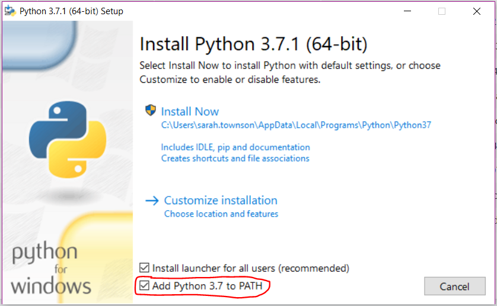

Install Python 3 on your personal computer
-------------

It is not necessary to do this, however you may wish to, as you cannot use thrid-party libraries (such as *matplotlib*) in Mu, without first installing Python.

If you wish to use third-person libraries without installing Python, you can use the online editor: https://repl.it/

To install Python on your computer, download the latest version of Python (currently 3.7.1) from: https://www.python.org/downloads/

If you are using a Mac, choose between the 64- or 32-bit version, based on your operating system.

.. image:: _mac_install.PNG

If you are using a Windows machine, choose between the 64- or 32-bit versions, based on your operating system.
You also have a choice between an executable file, or a web-based installer.
The second will be quicker to download, but will need internet access during the installation.

.. image:: _windows_install.PNG

If you are using a Linux machine, install python3 using your package manager e.g.::

    sudo apt-get install python3

**Check the box that asks you to 'Add Python 3.7 to PATH'**

then follow the default install instructions.
