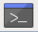

Saving files from a micro:bit
-------------

You can use the Python library *microfs* to access files on your microbit.

This library is not installed by default.
The following instructions will install *microfs* on the computer you are using (currently a Raspberry Pi), and requires Python3 installed.
You may or may not have Python3 installed on your home computer - see seperate instructions for how to do this.

Open the terminal by clicking this icon:

Type the following command::

    pip3 install microfs

.. image:: _pip_install.PNG

The install process might take a long time! You can continue to work on your program while it is installing.
When it has finished, *microfs* is now installed on this computer.

In the terminal (not in Mu), while your micro:bit is plugged in, type the following command::

    ufs ls

This will list all the files currently on your micro:bit.

To save a file from your micro:bit, type the following command::

    ufs get light_reading.txt
    
where *light_reading.txt* is the name of the file you want to save.

The file is now saved on your computer, in the default save location.

The official documentation for the *microfs* library can be found here:
https://pypi.org/project/microfs/
