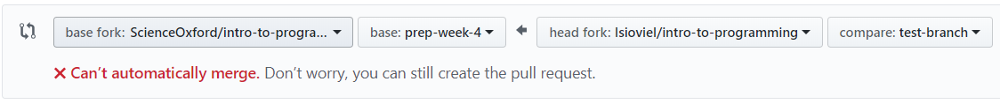
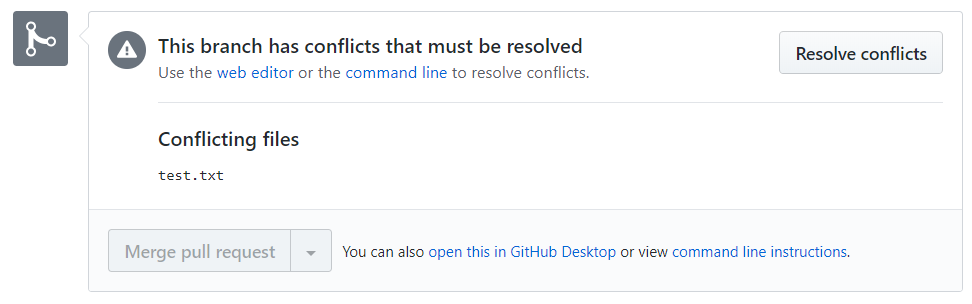

Functions
-------------

**Step 1:** Create an account.

**Step 2:** Fork this repository.

.. image:: _fork.PNG

**Step 3:** In your fork, create a new file in the 'welcome to github' folder called your_name.txt

.. image:: _create_new_file.PNG

**Step 4:** When you have written something in the file, scroll to the bottom, and click 'commit changes'.

.. image:: _commit.PNG

Any changes you make to your fork, will stay in your fork only - they won't affect the original repository.

**Step 5:** To request that your changes be merged into the original, you need to submit a pull request.

You will be warned at this stage whether there are any conficts.

If there are no conflicts, click the green 'Create pull request' button.

If there are conflicts, this could mean that you have been working on the same file as somebody else for example.

If you know what the conflict is, and how to avoid it, you can make the changes before submitting your pull request.
Don't worry if not though - you can submit your request anyway.

The repositiory owner will see a screen such as the one below, and be able to resolve the conflict.

**Step 6:** Now wait for your pull request to be accepted!

If the repository owner has any questions or suggestions, they can comment on the pull request before accepting it.

Once your pull request has been accepted, your changes will be merged with the original, and (if you are finished with it) you can delete your fork.
