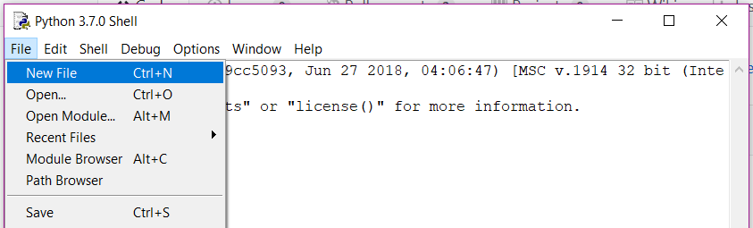

Guizero setup
-------------

**Step 1**: install Python3 on your computing by following these instructions:

https://github.com/ScienceOxford/intro-to-programming/blob/master/week-5/installing-python/installing_python.rst

If you are using a Mac, you may need to instead follow instructions such as these:

http://www.pyladies.com/blog/Get-Your-Mac-Ready-for-Python-Programming/

|

**The rest of these instructions assume you are using a Windows machine, or a Raspberry Pi.**

|

**Step 2**: install the guizero library:

Open the command prompt or terminal and type the following::

  pip3 install guizero

|

**Step 3**: open IDLE

IDLE is the *integrated development environment (IDE)* that comes bundled with Python. Mu is the IDE we have been using so far.
You may wish to use a different IDE in the future (a popular one is Atom), but for now IDLE will do what you need.

If you have more than one version of Python on your machine, you will have more than one version of IDLE. Make sure you open the latest version.

IDLE opens as the Python shell - this is where the **output** of your code will be, and where **error messages** will show up.

Create a new file to write your main program in:

|

**Step 4**: follow the Guizero tutorials

https://lawsie.github.io/guizero/start/

|

**Step 5**: create something!
