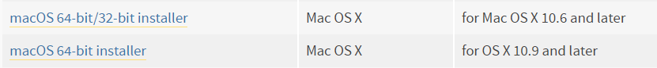
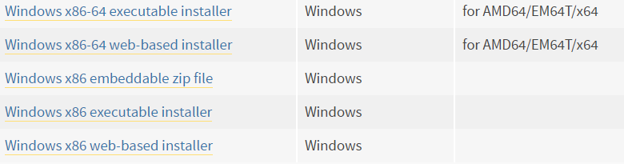
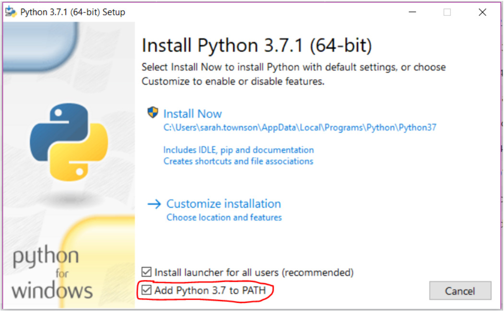

Install Python 3 on your personal computer
-------------

Unless you are doing a project based around the BBC micro:bit, we recommend that you install Python on your personal computer before getting started.
This means you will be able to install any extra libraries that you need, such as those recommended in the ideas file.

To install Python on your computer, download the latest version of Python (currently 3.7.1) from: https://www.python.org/downloads/

If you are using a Mac, choose between the 64- or 32-bit version, based on your operating system.

If you are using a Windows machine, choose between the 64- or 32-bit versions, based on your operating system.
You also have a choice between an executable file, or a web-based installer.
The second will be quicker to download, but will need internet access during the installation.

If you are using a Linux machine, install python3 using your package manager e.g.::

    sudo apt-get install python3

**Check the box that asks you to 'Add Python 3.7 to PATH'**

then follow the default install instructions.

Once Python is installed on your computer, you can install libraries by typing e.g. the following into your terminal or command line::

  pip3 install guizero
  
Where 'guizero' is the name of the library you wish to install.
