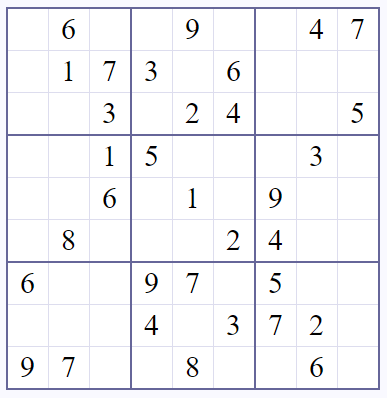

Getting started with a Sukoku solving program
-------------

*If you are more interested in creating sudoku puzzles than in solving them, switch to the Guizero instructions here: https://github.com/ScienceOxford/intro-to-programming/blob/master/week-5/guizero/set-up.rst*

This is a complicated project for your first independent program, so run through the problem step by step, and try to get one thing working at once!

A good place to start, would be inputting the sudoku puzzle you wish to solve, for example by reading from a text file.

**Suggestion:**

Decide on how you will format your starting grid.
For example, take this sudoku puzzle:

https://www.websudoku.com/?level=1&set_id=9143034716

You could save this in a .txt file, in the format::

  060 090 047
  017 306 000
  003 024 005

  001 500 030
  006 010 900
  080 002 400

  600 970 500
  000 403 720
  970 080 060

Using the syntax we covered in week 3, you could write a program to convert this into a list that your sudoku solver can use. This way, you could have a folder full of different sudoku grids ready to solve, and you just need to tell your program which one to access.

https://github.com/ScienceOxford/intro-to-programming/blob/master/week-3/data_manipulation.rst

As your program is reading the input, you could do some error checking on it - for example, make sure there are only 9 digits on a line, and make sure there are no duplicate digits on a line.

Once you have written a program to read sudoku grid data, you can work on your solving algorithm.

It is a good idea to first write your solution down in *pseudocode* i.e. write down your solution in logical steps that a computer can follow, but not in real Python.

**Next steps:**

Below is a link to someone else's solution to this problem, but it uses concepts we haven't covered during the course, and so will take some time to understand.

https://towardsdatascience.com/peter-norvigs-sudoku-solver-25779bb349ce

If you choose to read through the solution above, to start with read as far as **'The Cross Function'**. Stop when they begin to discuss list comprehensions - this increases the efficiency of code, but makes it less readable - for now, it is more important that you understand what is going on, than it is that your code is efficient!
